

  
  
   
  
  

  
  
  
  

 

  <h3>🎓 <b>PROFIL AKADEMIK</b> 🎓</h3>
  <table align="center" style="box-shadow: 0 4px 8px rgba(0,0,0,0.1); border-radius: 8px;">
    <tr>
      <td align="right"><b>Penulis / Mahasiswa</b></td>
      <td>🧑‍💻 <b>ILHAM PERMANA</b></td>
    </tr>
    <tr>
      <td align="right"><b>Mata Kuliah</b></td>
      <td>📚 ALGORITMA DAN PEMROGRAMAN DASAR</td>
    </tr>
    <tr>
      <td align="right"><b>Dosen Pengampu</b></td>
      <td>👩‍🏫 AI ELIS YULIATI, S.Kom.,M.Pd</td>
    </tr>
    <tr>
      <td align="right"><b>Tujuan Dokumen</b></td>
      <td>🎯 Pemenuhan Tugas Evaluasi Pembelajaran</td>
    </tr>
  </table>

 

---

## 📌 1. Pendahuluan

Dokumen ini disusun sebagai wujud pemenuhan tugas akademik untuk mata kuliah **Algoritma**. Tujuan utamanya adalah untuk memodelkan rancangan sistem informasi perangkat lunak secara logis, terstruktur, dan efisien. Laporan komprehensif ini memuat **16 arsitektur flowchart terstandarisasi** beserta penjelasan analitisnya untuk sebuah purwarupa sistem manajemen siklus hidup pengembangan perangkat lunak bernama **DevFlow**.

## 2. Legenda Simbol Flowchart
- **Terminator** `([ ])` : Titik Awal (Start) / Akhir (End)
- **Process** `[ ]` : Proses oleh sistem
- **Input/Output** `[/ /]` : Masukan atau keluaran sistem
- **Decision** `{ }` : Percabangan logika (YA/TIDAK)
- **Database** `[( )]` : Penyimpanan data
- **Document** `[/ \]` : Dokumen atau file keluaran (PDF/Excel)
- **Manual Operation** `[\ /]` : Operasi manual oleh manusia (Review/Interview)
- **Display** `{{ }}` : Layar atau antarmuka sistem
- **Connector** `(( ))` : Penghubung antar bagian flowchart

---

<h3>✨ FC-01 - Master Workflow SDLC <i>(Klik untuk ekspansi)</i></h3>

 

**Deskripsi:** Menggambarkan alur utama proyek dari awal hingga selesai.

**Tujuan:** Memberikan gambaran besar keseluruhan proses dalam aplikasi DevFlow.

**Aktor:** Client, Project Manager, Team Leader, Senior Developer, Developer, QA Engineer, DevOps Engineer, Mahasiswa Magang, System

### Penjelasan Detail Proses:
- **Start:** Proses SDLC dimulai ketika ada gagasan proyek baru.
- **Client Request:** Klien mengajukan permohonan pengembangan perangkat lunak.
- **Input Requirement:** Mengumpulkan daftar kebutuhan dan spesifikasi sistem dari klien.
- **Requirement Analysis:** Tim menganalisis kelayakan dan ruang lingkup dari requirement yang diberikan.
- **Requirement Validation:** Sistem atau tim memvalidasi kelengkapan requirement secara formal.
- **Requirement Complete?:** Jika tidak lengkap, kembali ke pengumpulan requirement. Jika lengkap, lanjut ke tahap persetujuan.
- **Project Approval:** Tahap persetujuan kontrak, biaya, dan scope oleh klien maupun manajemen.
- **Create Project:** Admin atau PM membuat entitas proyek di dalam sistem DevFlow.
- **Connector A:** Melanjutkan ke Bagian 2 untuk pembentukan tim dan perencanaan.
- **Assign Project Manager:** Menunjuk manajer proyek (PM) yang bertanggung jawab penuh terhadap proyek.
- **Sprint Planning:** PM dan tim merencanakan iterasi pengerjaan (Sprint).
- **Assign Team Leader:** PM menunjuk pimpinan teknis (Team Leader).
- **Assign Senior Developer:** Penunjukan developer senior sebagai reviewer dan arsitek kode.
- **Assign Developer:** Mengalokasikan developer untuk pengerjaan kode (coding).
- **Assign QA Engineer:** Menugaskan tim Quality Assurance untuk menjaga kualitas aplikasi.
- **Assign Internship:** Melibatkan mahasiswa magang untuk membantu proyek jika diperlukan.
- **Create Task:** Memecah requirement menjadi satuan tugas (task) yang lebih kecil di Kanban.
- **Connector B:** Melanjutkan ke Bagian 3 untuk tahap eksekusi kode.
- **Development:** Developer mulai menulis dan mengembangkan kode aplikasi.
- **Code Review:** Senior Developer memeriksa kode yang telah di-submit oleh developer.
- **Code Review Approve?:** Jika ada masalah (TIDAK), kode dikembalikan ke tahap development. Jika lolos (YA), lanjut ke build.
- **Build Project:** Sistem mengkompilasi dan mem-build kode menjadi aplikasi terintegrasi.
- **QA Testing:** Tim QA melakukan skenario pengujian fungsional pada aplikasi.
- **QA Passed?:** Jika gagal, bug dikembalikan ke tahap development. Jika lolos, siap dirilis.
- **Deployment:** Aplikasi dirilis ke lingkungan production (live).
- **Monitoring:** Tim DevOps memantau kestabilan aplikasi setelah dirilis ke publik.
- **Client Review:** Klien mencoba aplikasi dan memberikan tanggapan/feedback.
- **Client Approve?:** Jika klien meminta perubahan, aplikasi masuk tahap revisi. Jika setuju, proyek selesai.
- **Project Closed:** Status proyek dikunci dan dinyatakan secara resmi selesai (Closed).
- **Generate Report:** Sistem otomatis membuat laporan akhir pengembangan sistem.
- **End:** Proses Master SDLC untuk proyek tersebut berakhir sepenuhnya.

### Diagram
```mermaid
graph TD
classDef start fill:#3498db,stroke:#2980b9,color:#fff;
classDef endNode fill:#2ecc71,stroke:#27ae60,color:#fff;
classDef process fill:#ecf0f1,stroke:#bdc3c7,color:#2c3e50;
classDef decision fill:#f1c40f,stroke:#f39c12,color:#2c3e50;
classDef db fill:#9b59b6,stroke:#8e44ad,color:#fff;
classDef doc fill:#e67e22,stroke:#d35400,color:#fff;
classDef io fill:#a2d9ce,stroke:#1abc9c,color:#2c3e50;
classDef manual fill:#e84393,stroke:#fd79a8,color:#fff;
classDef display fill:#00cec9,stroke:#81ecec,color:#2c3e50;
classDef conn fill:#ecf0f1,stroke:#34495e,stroke-width:2px;
classDef error fill:#e74c3c,stroke:#c0392b,color:#fff;
%% Part 1
subgraph B1["Part 1 (Start → A)"]
direction TB
A([Start]):::start --> B[/"Client Request"/]:::io
B --> C[/"Input Requirement"/]:::io
C --> D[\"Requirement Analysis"/]:::manual
D --> E[Requirement Validation]:::process
E --> F{"Requirement Complete?"}:::decision
F -- TIDAK --> C
F -- YA --> G[\"Project Approval"/]:::manual
G --> H[Create Project]:::process
H --> CA1((A)):::conn
end
%% Part 2
subgraph B2["Part 2 (A → B)"]
direction TB
CA2((A)):::conn --> I[Assign Project Manager]:::process
I --> J[Sprint Planning]:::process
J --> K[Assign Team Leader]:::process
K --> L[Assign Senior Developer]:::process
L --> M[Assign Developer]:::process
M --> N[Assign QA Engineer]:::process
N --> O[Assign Internship]:::process
O --> P[Create Task]:::process
P --> CB1((B)):::conn
end
%% Part 3
subgraph B3["Part 3 (B → End)"]
direction TB
CB2((B)):::conn --> Q[Development]:::process
Q --> R[\"Code Review"/]:::manual
R --> S{"Code Review Approve?"}:::decision
S -- TIDAK --> REV1[Kembali ke Development]:::process
S -- YA --> T[Build Project]:::process
T --> U[QA Testing]:::process
U --> V{"QA Passed?"}:::decision
V -- TIDAK --> REV2[Kembali ke Development]:::process
V -- YA --> W[Deployment]:::process
W --> X{{Monitoring}}:::display
X --> Y[\"Client Review"/]:::manual
Y --> Z{"Client Approve?"}:::decision
Z -- TIDAK --> REV3[Revisi & Development]:::process
Z -- YA --> AA([Project Closed]):::endNode
AA --> AB[Generate Report]:::process
AB --> AC([End]):::endNode
end
CA1 ~~~ CA2
CB1 ~~~ CB2
```

---

<h3>✨ FC-02 - Login & Authentication <i>(Klik untuk ekspansi)</i></h3>

 

**Deskripsi:** Proses otentikasi user untuk mengakses sistem DevFlow.

**Tujuan:** Memastikan hanya user yang terdaftar yang memiliki akses.

**Aktor:** Semua User, System

### Penjelasan Detail Proses:
- **Start:** Pengguna membuka halaman login aplikasi DevFlow.
- **Input Username:** Pengguna memasukkan identitas atau email.
- **Input Password:** Pengguna memasukkan kata sandi (password).
- **Login:** Pengguna menekan tombol untuk masuk ke sistem.
- **Validasi User:** Sistem mencari data pengguna berdasarkan username di database.
- **User Valid?:** Jika pengguna tidak ditemukan, kembali ke halaman awal. Jika ditemukan, lanjut validasi.
- **OTP Verification:** Sistem mengirimkan dan meminta kode OTP untuk lapisan keamanan ganda.
- **OTP Valid?:** Jika salah, pengguna diminta memasukkan ulang. Jika benar, otentikasi berhasil.
- **Load Role:** Sistem memuat hak akses khusus milik pengguna (Admin, PM, Dev, dll).
- **Load Permission:** Sistem mengatur menu dan tombol apa saja yang boleh diakses.
- **Dashboard:** Mengarahkan pengguna ke halaman utama (Dashboard) sesuai jabatannya.
- **Session Login:** Sesi aktif dibuat agar pengguna tidak perlu login berulang kali.
- **Logout:** Pengguna mengakhiri sesi dan keluar dari aplikasi secara aman.
- **End:** Proses otentikasi (login/logout) selesai.

### Diagram
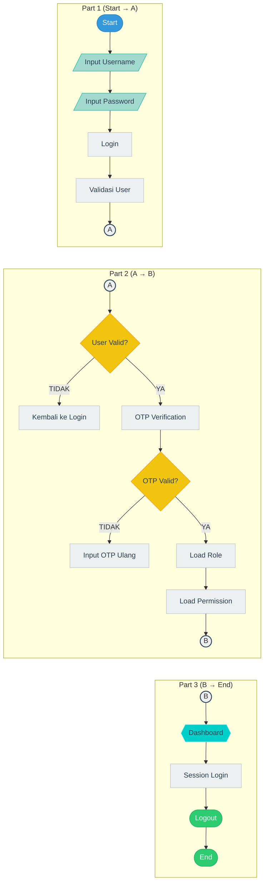

---

<h3>✨ FC-03 - Dashboard <i>(Klik untuk ekspansi)</i></h3>

 

**Deskripsi:** Tampilan utama sistem setelah user berhasil login.

**Tujuan:** Menyajikan ringkasan informasi, statistik, dan progress project.

**Aktor:** Semua User

### Penjelasan Detail Proses:
- **Start:** Pengguna berhasil melewati otentikasi login.
- **Load Dashboard:** Sistem mulai merender halaman utama dashboard.
- **Ambil Data User:** Menarik informasi profil pengguna yang sedang aktif.
- **Ambil Data Project:** Mengambil ringkasan dari proyek-proyek yang ditangani pengguna.
- **Ambil Statistik:** Memuat grafik atau angka metrik performa (Key Performance Indicators).
- **Ambil Sprint:** Mengambil informasi sprint (iterasi) yang sedang aktif berjalan.
- **Ambil Task:** Menarik daftar tugas/tiket yang berstatus belum selesai (To-Do/In Progress).
- **Ambil Deadline:** Memeriksa tugas-tugas yang mendekati batas waktu akhir (SLA).
- **Ambil Progress:** Menghitung persentase pencapaian kerja developer/magang saat ini.
- **Tampilkan Dashboard:** Menyajikan dan melukis semua data tersebut ke layar browser pengguna secara visual.
- **Refresh Data:** Memperbarui data secara berkala atau ketika diminta secara asinkron.
- **End:** Proses penyajian dashboard selesai.

### Diagram
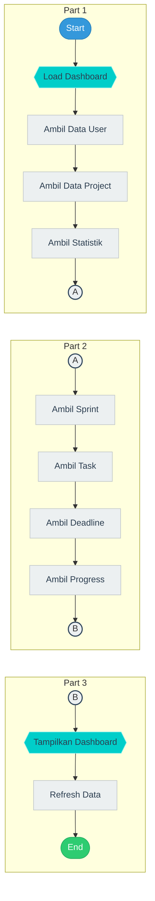

---

<h3>✨ FC-04 - User Management <i>(Klik untuk ekspansi)</i></h3>

 

**Deskripsi:** Modul untuk mengelola data pengguna sistem.

**Tujuan:** Mengatur akun pengguna dan hak akses.

**Aktor:** Super Admin, Admin, HRD, System

### Penjelasan Detail Proses:
- **Start:** Administrator mengakses modul User Management.
- **Tambah User:** Menginput data karyawan, mahasiswa magang, atau klien baru.
- **Edit User:** Mengubah informasi profil pengguna yang sudah ada sebelumnya.
- **Hapus User:** Menghapus entri data pengguna dari sistem.
- **Assign Role:** Menentukan tingkat jabatan pengguna (Super Admin, HRD, QA, Dev, dsb).
- **Assign Permission:** Menambahkan hak akses spesifik untuk memberikan izin akses modul tertentu.
- **Reset Password:** Mengembalikan kata sandi jika pengguna melupakannya.
- **Aktivasi User:** Menghidupkan status akun agar pengguna diizinkan login ke sistem.
- **Nonaktifkan User:** Membekukan akun pengguna yang resign atau telah selesai program magang.
- **Simpan Database:** Sistem memvalidasi dan menyimpan seluruh perubahan ke User Database.
- **End:** Siklus manajemen pengguna selesai dieksekusi.

### Diagram
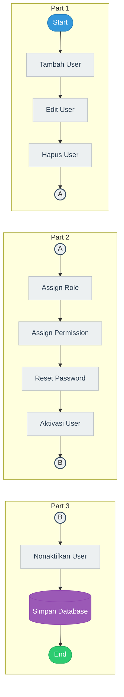

---

<h3>✨ FC-05 - Project Management <i>(Klik untuk ekspansi)</i></h3>

 

**Deskripsi:** Proses pembuatan dan pengelolaan project.

**Tujuan:** Mencatat detail project dan penugasan tim.

**Aktor:** Admin, Project Manager, System

### Penjelasan Detail Proses:
- **Start:** Admin atau PM mulai mendaftarkan proyek baru.
- **Create Project:** Membuka entitas proyek baru dalam aplikasi DevFlow.
- **Input Client:** Memasukkan/memilih informasi klien atau perusahaan pemesan perangkat lunak.
- **Input Requirement:** Mengunggah dokumen spesifikasi fitur dan cakupan proyek (Scope of Work).
- **Input Timeline:** Menentukan kapan proyek dimulai dan target bulan penyelesaian.
- **Assign PM:** Manajemen mendelegasikan Project Manager sebagai komando proyek.
- **Assign Team:** PM menunjuk tim yang akan bekerja (TL, Backend, Frontend, QA).
- **Input Budget:** Mencatat rincian RAB (Rencana Anggaran Biaya) proyek tersebut.
- **Simpan Project:** Menyatukan seluruh data awal dan menyimpannya di Project Database.
- **Update Project:** Modifikasi data di tengah berjalannya proyek jika terjadi perubahan spesifikasi (Change Request).
- **Monitoring:** PM terus memantau kesehatan waktu dan anggaran (Budget vs Actual).
- **Close Project:** Menutup proyek yang telah rampung agar tidak ada perubahan data insidentil lagi.
- **End:** Penanganan proyek selesai.

### Diagram
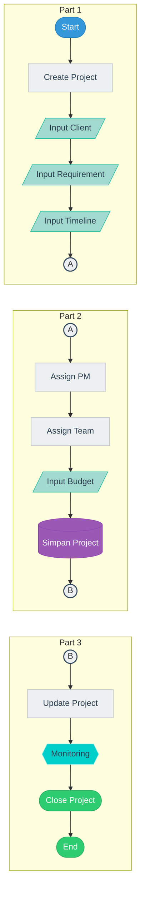

---

<h3>✨ FC-06 - Sprint Planning <i>(Klik untuk ekspansi)</i></h3>

 

**Deskripsi:** Perencanaan dan penjadwalan sprint.

**Tujuan:** Menetapkan sprint goal dan backlog.

**Aktor:** Project Manager, Team Leader, System

### Penjelasan Detail Proses:
- **Start:** Siklus pengembangan Agile dimulai dengan persiapan sprint.
- **Create Sprint:** Membuat data iterasi (sprint) bernomor urut.
- **Sprint Goal:** Menetapkan satu tujuan fokus yang ingin diraih pada akhir sprint.
- **Sprint Backlog:** PM/TL memilih tiket task yang akan dieksekusi di sprint ini.
- **Story Point:** Tim memperkirakan bobot usaha/kesulitan untuk setiap task.
- **Assign Task:** Menugaskan tiket-tiket tersebut kepada developer spesifik.
- **Timeline:** Menetapkan hari pertama dan hari terakhir sprint (umumnya 2 minggu).
- **Sprint Active:** Sprint diluncurkan, developer mulai mengubah status task (To-Do -> In Progress).
- **Sprint Review:** Di akhir timeline sprint, tim berkumpul mereview apa yang selesai dan tidak selesai.
- **Sprint Closed:** Sprint dikunci, perhitungan kecepatan tim (velocity) direkam secara otomatis.
- **End:** Tahapan Sprint Planning selesai dilakukan.

### Diagram
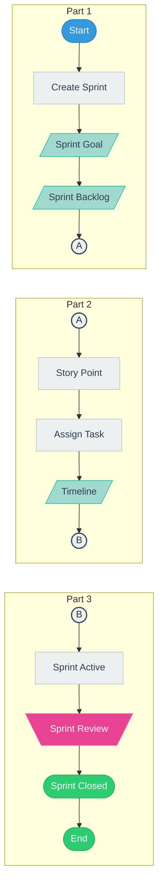

---

<h3>✨ FC-07 - Task Management <i>(Klik untuk ekspansi)</i></h3>

 

**Deskripsi:** Pengelolaan task development.

**Tujuan:** Mendistribusikan pekerjaan ke developer dan magang.

**Aktor:** Team Leader, Developer, Mahasiswa Magang, System

### Penjelasan Detail Proses:
- **Start:** TL perlu mendelegasikan fitur teknis menjadi pekerjaan diskrit.
- **Create Task:** Membuat tiket tugas dengan judul dan deskripsi rinci.
- **Assign Developer:** Menunjuk tiket kerjaan tersebut kepada programmer tetap.
- **Assign Internship:** Mengalokasikan tugas berlevel pemula kepada mahasiswa magang.
- **Priority:** Menentukan tingkat kepentingan (Low/Normal/High/Blocker).
- **Deadline:** Mengunci tanggal wajib selesai untuk tiket tugas tersebut.
- **Start Task:** Assignee mengeklik tombol mulai yang menghitung durasi pengerjaan.
- **Progress:** Papan kanban memperbarui posisinya, status progres dilacak sistem.
- **Review Task:** Saat tugas dinyatakan selesai, TL atau Code Reviewer mengecek hasil kerjanya.
- **Complete Task:** Tugas lolos standar dan diubah statusnya menjadi Done.
- **Close Task:** Tugas ditutup, poin kinerja ditambahkan ke metrik pencapaian tim.
- **End:** Siklus satu pekerjaan terkecil selesai.

### Diagram
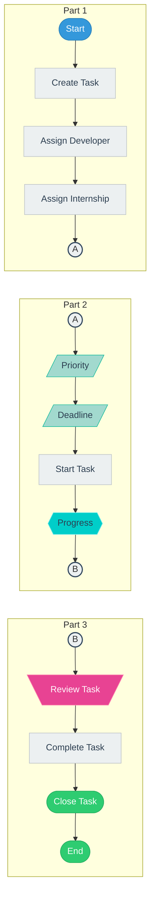

---

<h3>✨ FC-08 - Internship Management <i>(Klik untuk ekspansi)</i></h3>

 

**Deskripsi:** Proses pengelolaan mahasiswa magang.

**Tujuan:** Mengelola siklus magang dari registrasi hingga sertifikat.

**Aktor:** HRD, Mentor, Mahasiswa Magang, System

### Penjelasan Detail Proses:
- **Start:** Periode penerimaan mahasiswa magang MBKM (Kampus Merdeka) dibuka.
- **Registrasi:** Mahasiswa mendaftarkan diri secara daring ke sistem perusahaan.
- **Pilih Kampus:** Calon peserta mengidentifikasi dari universitas mana mereka berasal.
- **Upload Dokumen:** Mengunggah lampiran seperti portofolio, KHS, dan surat rekomendasi.
- **Verifikasi:** HRD memverifikasi validitas berkas yang dikirim.
- **Seleksi:** HRD menyaring kandidat terbaik sesuai kuota departemen.
- **Interview:** Memanggil kandidat terpilih untuk wawancara kultur dan kompetensi.
- **Lulus?:** Jika hasil seleksi tidak memenuhi syarat, proses rekrutmen berhenti di sini.
- **Assign Mentor:** Jika lulus, kandidat dipasangkan dengan pembimbing praktis (Senior Developer).
- **Assign Project:** Peserta magang dilibatkan secara langsung ke dalam pengembangan proyek nyata.
- **Daily Report:** Mahasiswa wajib mencatat poin harian pekerjaan mereka di sistem (Logbook).
- **Monitoring:** Mentor dan dosen pembimbing meninjau produktivitas harian mahasiswa.
- **Evaluasi:** Pemberian _feedback_ di pertengahan dan akhir periode magang.
- **Sertifikat:** Penerbitan e-sertifikat yang tervalidasi secara otomatis dari sistem tanda kelulusan.
- **End:** Program pemagangan per batch selesai.

### Diagram
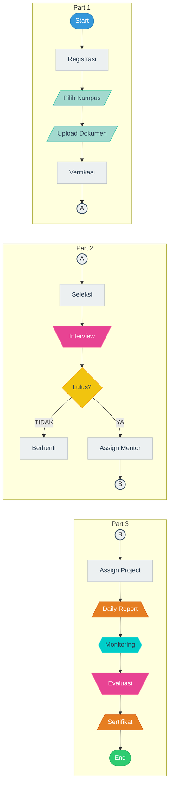

---

<h3>✨ FC-09 - Development Workflow <i>(Klik untuk ekspansi)</i></h3>

 

**Deskripsi:** Alur proses koding hingga disetujui (merge).

**Tujuan:** Menjaga kualitas kode sebelum dideploy.

**Aktor:** Developer, Senior Developer, System

### Penjelasan Detail Proses:
- **Start:** Developer mendapat notifikasi untuk mengerjakan sebuah task spesifik.
- **Checkout Branch:** Developer membuat percabangan source code khusus (feature branch) dari master branch.
- **Coding:** Developer merangkai algoritma, integrasi logika, dan desain secara lokal.
- **Commit Git:** Merangkum setiap perubahan kecil kode tersebut ke dalam satu log perubahan.
- **Push Repository:** Mengunggah kode lokal itu secara aman ke repositori online (seperti Gitlab/Github).
- **Pull Request:** Mengirim permohonan ke tim inti agar cabang fitur baru tersebut disatukan dengan aplikasi utama.
- **Code Review:** Reviewer ahli membedah baris kode, memastikan tidak ada kecacatan logika/kemanan.
- **Approve?:** Jika ada _code smell_ (TIDAK), permohonan ditolak dan kembali ke tahap coding. Jika lulus standar (YA), disetujui.
- **Merge Branch:** Sistem menggabungkan fitur baru tersebut ke _branch_ utama secara otomatis.
- **Build:** Sistem secara asinkron mencoba merakit ulang aplikasi (CI/CD Pipeline).
- **Deploy Staging:** Artefak hasil build diinjeksi ke environment staging agar diujicobakan QA.
- **End:** Tugas murni pengembang algoritma selesai, diserahkan ke QA.

### Diagram
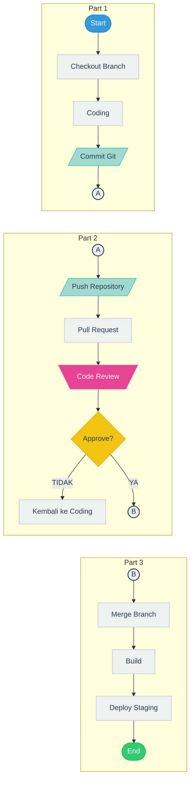

---

<h3>✨ FC-10 - QA Testing <i>(Klik untuk ekspansi)</i></h3>

 

**Deskripsi:** Pengujian fungsionalitas dan performa aplikasi.

**Tujuan:** Memastikan bebas dari bug.

**Aktor:** QA Engineer, System

### Penjelasan Detail Proses:
- **Start:** QA Engineer menerima notifikasi bahwa fitur baru siap di-staging server.
- **Unit Test:** Memastikan potongan script/fungsi-fungsi kecil beroperasi dengan benar.
- **Functional Test:** Mencocokkan kemampuan aplikasi dengan spesifikasi Requirement Document.
- **Integration Test:** Memastikan tidak ada kendala koneksi saat fitur tersebut menarik data dari modul lain (API).
- **Regression Test:** Menjalankan pengujian otomatis ke fitur lama untuk memastikan update tidak merusak sistem lama.
- **UAT:** User Acceptance Test, diuji seakan QA ini adalah pengguna nyata (Simulasi Black Box).
- **QA Passed?:** Memutuskan apakah keseluruhan pengujian telah membuktikan bahwa rilis stabil.
- **QA Approval:** Jika disetujui, QA menandatangani persetujuan secara elektronik tiket tersebut layak rilis (Production).
- **End:** Tahap mitigasi risiko (kualitas) ditutup.

### Diagram
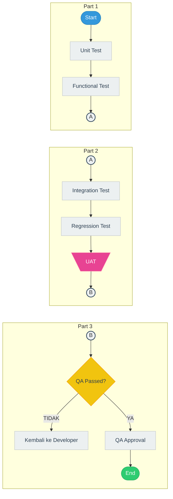

---

<h3>✨ FC-11 - Bug & Issue Management <i>(Klik untuk ekspansi)</i></h3>

 

**Deskripsi:** Manajemen perbaikan error yang ditemukan.

**Tujuan:** Menangani isu secara terstruktur.

**Aktor:** QA Engineer, Developer, System

### Penjelasan Detail Proses:
- **Start:** Sebuah kerusakan fungsi (Bug) terdeteksi dan perlu pelacakan (Issue Tracking).
- **Input Bug:** QA/Pelapor memasukkan log kejadian, screenshot, dan langkah-langkah erornya.
- **Severity:** Klasifikasi darurat, apakah eror ini menghentikan sistem (Blocker/High) atau sekadar kosmetik (Low).
- **Assign Developer:** Tiket bug didistribusikan ke developer yang punya kapabilitas modul terkait.
- **Bug Fix:** Developer menganalisa, mencari sumber bocor logika, dan menulis perbaikannya.
- **Commit:** Melampirkan kode baru ke repository sebagai _hot-patch_ perbaikan.
- **Retest:** QA memeriksa silang untuk meyakinkan masalah telah lenyap, baik pada server tes maupun staging.
- **Bug Fixed?:** Evaluasi apakah perilaku aneh benar-benar berhenti setelah ditempelkan kode perbaikan.
- **Close Issue:** Status tiket diubah menjadi Tuntas (Resolved/Closed).
- **End:** Prosedur isolasi masalah selesai.

### Diagram
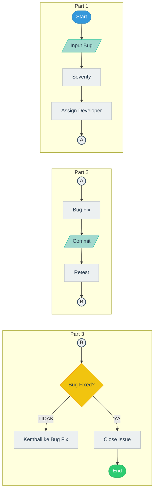

---

<h3>✨ FC-12 - Deployment <i>(Klik untuk ekspansi)</i></h3>

 

**Deskripsi:** Rilis aplikasi ke environment Production.

**Tujuan:** Memastikan proses deploy yang aman.

**Aktor:** DevOps Engineer, System

### Penjelasan Detail Proses:
- **Start:** Menjelang akhir sprint atau perilisan sistem versi baru.
- **Build Production:** Merakit kode khusus mode live (optimasi skrip, menghilangkan console log/debug info).
- **Backup Database:** Menyalin isi database klien secara total sebelum skema tabel diubah oleh pembaruan baru.
- **Backup Source Code:** Menyalin binari / source aplikasi lama sebagai pegangan (Fall-back).
- **Deploy:** Memindahkan file sistem ke peladen langsung (Live Server/Cloud).
- **Health Check:** Melakukan pemeriksaan _ping_, _resource usage_, dan keaktifan database.
- **Success?:** Mengevaluasi indikator Health Check dan aksesibilitas.
- **Rollback:** Jika server merespons 500/Crash, skrip cadangan ditarik ulang secara instan menimpa perilisan gagal tersebut.
- **Monitoring:** Jika berhasil, parameter uptime, memory leak, dan jaringan diawasi dari dashboard ops.
- **End:** Operasi migrasi ke ranah produksi selesai dilaksanakan.

### Diagram
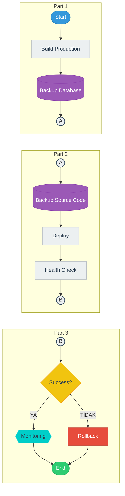

---

<h3>✨ FC-13 - Maintenance <i>(Klik untuk ekspansi)</i></h3>

 

**Deskripsi:** Pemeliharaan aplikasi pasca rilis.

**Tujuan:** Menjaga stabilitas aplikasi.

**Aktor:** DevOps Engineer, System

### Penjelasan Detail Proses:
- **Start:** Berjalannya waktu sesaat setelah perangkat lunak dipasarkan ke end-user.
- **Monitoring:** Tim memantau stabilitas sistem sepanjang 24 jam sehari 7 hari seminggu (SLA).
- **Analisis Error:** Membedah _error logs_ manakala terdapat pelaporan dari pelanggan jika ada transaksi macet.
- **Patch:** Tim memberikan rilis mini/koreksi atas bug kosmetik atau bug non-esensial secara berkala.
- **Hotfix:** Meluncurkan rilis penambal di hari yang sama khusus jika _downtime_ massal terjadi (Tindakan Kritis).
- **Testing:** Meski dirilis cepat (hotfix/patch), ia tetap harus lolos pengecekan dasar.
- **Release:** Publikasi pembaruan perbaikan tersebut ke server pelanggan.
- **Monitoring:** Pemantauan intensif di-reset kembali (Loop tertutup).
- **End:** Satu siklus perbaikan operasional teratasi.

### Diagram
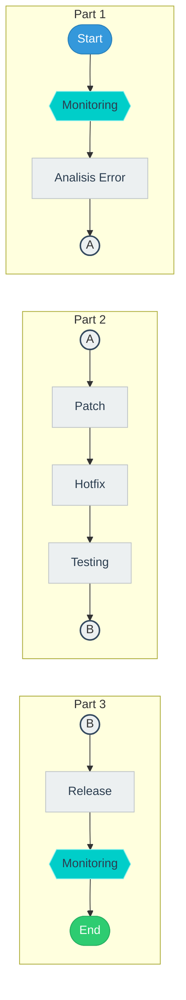

---

<h3>✨ FC-14 - Notification Center <i>(Klik untuk ekspansi)</i></h3>

 

**Deskripsi:** Manajemen notifikasi ke pengguna.

**Tujuan:** Menginformasikan event sistem.

**Aktor:** System

### Penjelasan Detail Proses:
- **Start:** Saat terjadi perubahan event di seluruh fitur DevFlow.
- **Generate Notification:** Mesin merangkai jenis notifikasi, isi teks, dan peruntukannya (Siapa yang harus menerimanya).
- **Email:** Memasukkan notifikasi penting ke layanan email perusahaan.
- **Dashboard Notification:** Membunyikan notifikasi lonceng internal pada sistem DevFlow pengguna.
- **Task Notification:** Menyematkan pesan saat ada anggota tim yang menyebut (tag/mention) seseorang di dalam komentar tiket task.
- **Reminder:** Alarm peringatan batas tenggat waktu 3 hari atau 1 hari sebelum (overdue).
- **Push Notification:** Meneruskan pesan tersebut sebagai notifikasi native ke piranti/ponsel jika memungkinkan.
- **Log Notification:** Memasukkan data kapan dibaca, kapan ditolak ke dalam database (Auditing System).
- **End:** Pengiriman pemberitahuan berakhir.

### Diagram
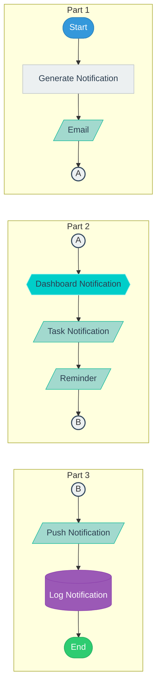

---

<h3>✨ FC-15 - Reporting <i>(Klik untuk ekspansi)</i></h3>

 

**Deskripsi:** Generasi laporan aktivitas dan performa.

**Tujuan:** Untuk tracking dan manajemen.

**Aktor:** System, PM, HRD

### Penjelasan Detail Proses:
- **Start:** Manajer proyek (PM) ingin menarik rekapan tagihan atau evaluasi bulanan.
- **Ambil Data Project:** Melakukan query gabungan performa timeline & budget menyeluruh.
- **Ambil Sprint:** Mengonfirmasi status penyelesaian sprint-sprint (Velocity / Burndown Chart).
- **Ambil Developer:** Menarik statistik jumlah jam/task tuntas tiap developer.
- **Generate Statistik:** Membangun format data agar siap dibaca oleh pustaka charting (grafik/pie chart).
- **Generate Report:** Menyusun komponen (judul, logo, tabel, dll) untuk laporan utuh.
- **Export PDF:** Mengubah HTML data ke bentuk _Portable Document Format_ yang ajeg/bersih.
- **Export Excel:** Mengekstrak data serupa ke format _Comma-Separated_ (CSV/Excel) untuk olah kalkulasi lanjutan.
- **Print:** Modul menyediakan _Print Layout_ rapi jika pengguna butuh lembar bukti fisik (Hardcopy).
- **Arsip:** Salinan virtual digandakan ke media cold-storage historis yang tidak bisa diubah.
- **End:** Tahap perolehan laporan evaluasi perusahaan selesai.

### Diagram
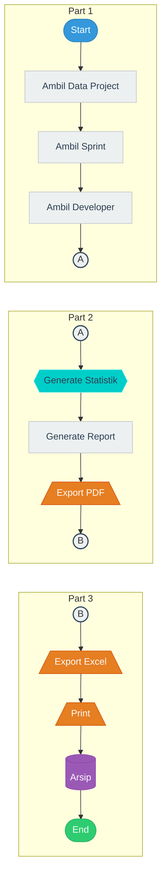

---

<h3>✨ FC-16 - Client Approval <i>(Klik untuk ekspansi)</i></h3>

 

**Deskripsi:** Proses UAT dan persetujuan dari klien.

**Tujuan:** Memastikan deliverable sesuai requirement.

**Aktor:** Client, Project Manager, System

### Penjelasan Detail Proses:
- **Start:** Puncak proyek di mana DevFlow mengkoordinir peresmian perangkat lunak.
- **Client Review:** Klien mengoperasikan langsung sistem di komputer mereka untuk pertama kali.
- **Feedback:** Klien memberikan tanggapan/surat permohonan atas _bug_ kecil yang tidak tersaring tim Dev.
- **Revisi:** Tim Dev melakukan modifikasi cepat/revisi spesifik sesuai masukan klien.
- **Final Testing:** Menguji hasil rilis ulang tersebut apakah fitur perbaikan berjalan stabil.
- **Approval?:** Titik keputusan krusial di mana klien harus menyatakan YA (Puas) atau TIDAK.
- **Project Closed:** Jika setuju, kunci sistem mencegah siapapun mengubah kode. Masa pengembangan usai.
- **Generate Final Report:** Laporan puncak tentang realisasi SLA dan pendanaan.
- **Berita Acara Serah Terima:** Mencetak dokumen final serah-terima kekayaan intelektual perangkat lunak kepada klien.
- **End:** Proyek ditutup sempurna, beralih ke masa _maintenance_.

### Diagram
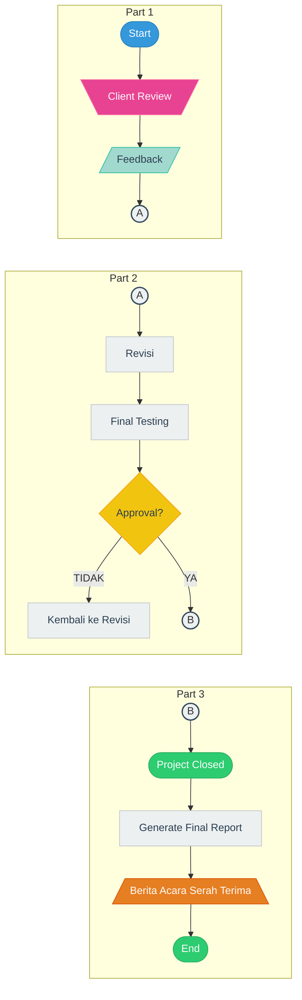

---

## Hak Cipta dan Lisensi Akademik (Academic License)

© 2026 **Ilham Permana**. Hak Cipta Dilindungi.

Dokumen dan seluruh rancangan algoritma *flowchart* di dalam repositori ini dirancang dan ditulis sepenuhnya oleh **Ilham Permana** sebagai bagian dari tugas perkuliahan **ALGORITMA DAN PEMROGRAMAN DASAR** yang diampu oleh **AI ELIS YULIATI, S.Kom.,M.Pd**. 

Proyek ini dilisensikan secara terbuka untuk keperluan edukasi dan referensi (*Academic/MIT License*). Penggunaan, penyalinan, atau modifikasi dari dokumen ini untuk keperluan penelitian atau belajar sangat diizinkan dengan menyertakan atribusi yang sesuai kepada penulis asli.
